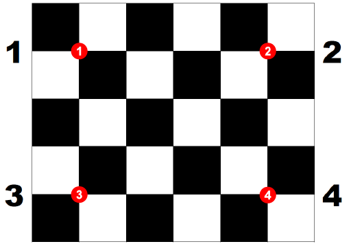

# 座標系統

## 裝置參考座標系

每個裝置都有相對的參考座標系，在個別的輸入或輸出上皆須使用各自的參考座標系，例如：相機目標檢測取得的座標為相機的參考座標系的資料、機械手臂在控制移至定點時須使用本身的參考座標系。

## 校正

在校正相機與機械手臂之前，先將[校正卡](../../_static/calibration_card.pdf)列印出來。

對一台相機與一台機械手臂之參考座標系校正。校正方法的順序如下：
1. 將校正卡放置於相機可拍攝到的區域以及機械手臂的工作區域內。
1. 擷取指定編號之相機影像上的校正卡，會檢測到校正卡的四個角落交叉點之位置（下圖紅點處）。
1. 將機械手臂移至校正卡上指定的四個點位（下圖紅點處）並分別記錄位置。
1. 將機械手臂移置其末端工具碰到校正卡，紀錄高度。
1. 執行校正計算。



## 在任務中轉換座標系

註：相機是2D平面座標系，目標檢測之結果為2D資訊，在轉換至機械手臂的座標時，需加入目標物件的高度。

### Blockly API


### Python API

```
GmiiVisionAPI.TargetPositionToDobotMagicianCoordinate(GmiiVisionSocket, 0, 0, [0, 0, 0, 0], 0) # 相機編號, Magician編號, 相機座標系的座標, 高度
GmiiVisionAPI.TargetPositionToDobotM1Coordinate(GmiiVisionSocket, 0, 0, [0, 0, 0, 0], 0) # 相機編號, Magician編號, 相機座標系的座標, 高度
```
