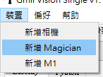
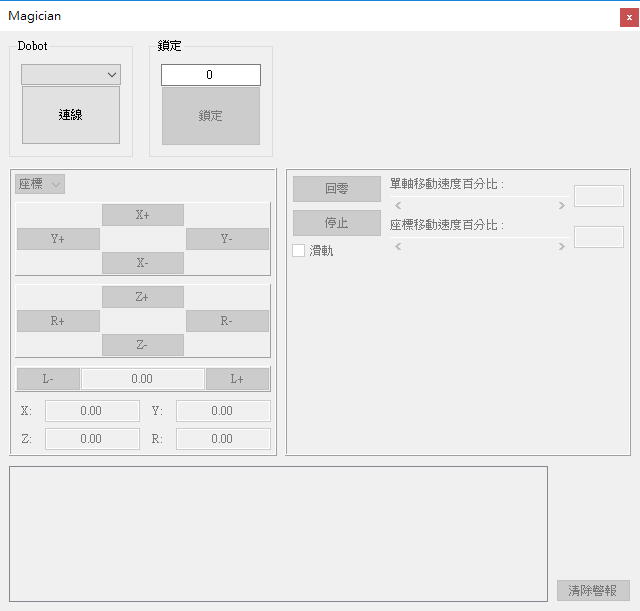
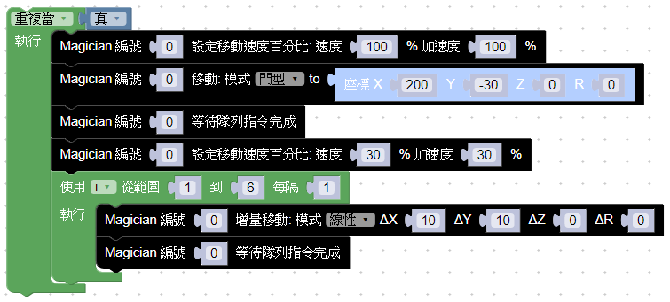

# Dobot Magician

## 新增 Magician

在裝置選單中選擇新增 Magician，選取裝置連接埠後連線。



##	手臂控制器



- 鎖定：需先設定裝置鎖定之編號後鎖定，才能在任務中使用。
- 控制：控制器中間區域為控制區，連接後可以控制和設定手臂。
- 警報：若操控有誤或是裝置出現故障，下方會顯示出警報資訊。

## 在任務中使用手臂

Blockly和Python皆提供控制手臂的API，API的編號對應手臂控制器鎖定的編號，相同編號並且鎖定的手臂會執行對應的任務。

### Blockly 範例



### Python 範例

```
from api import GmiiVisionAPI
import time

GmiiVisionSocket = GmiiVisionAPI.load()


i = None


while True:
  GmiiVisionAPI.DobotMagician_SetPTPCommonParams(GmiiVisionSocket, 0, 100, 100)
  GmiiVisionAPI.DobotMagician_SetPTPCmd(GmiiVisionSocket, 0, 0, [200, (-30), 0, 0])
  GmiiVisionAPI.DobotMagician_WaitQueuedCmdCompleted(GmiiVisionSocket, 0)
  GmiiVisionAPI.DobotMagician_SetPTPCommonParams(GmiiVisionSocket, 0, 30, 30)
  for i in range(1, 7):
    GmiiVisionAPI.DobotMagician_SetPTPCmd(GmiiVisionSocket, 0, 7, [10, 10,  0, 0])
    GmiiVisionAPI.DobotMagician_WaitQueuedCmdCompleted(GmiiVisionSocket, 0)
```
