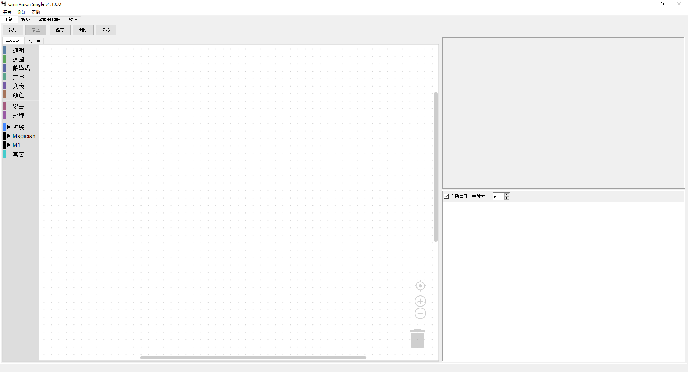
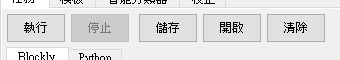
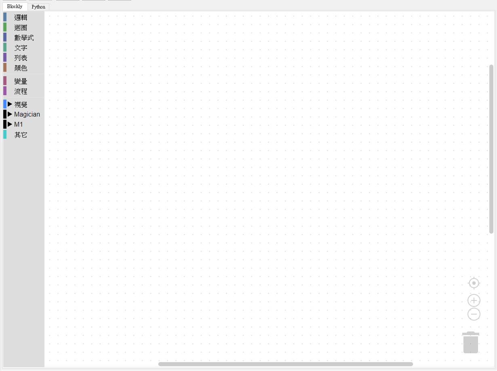
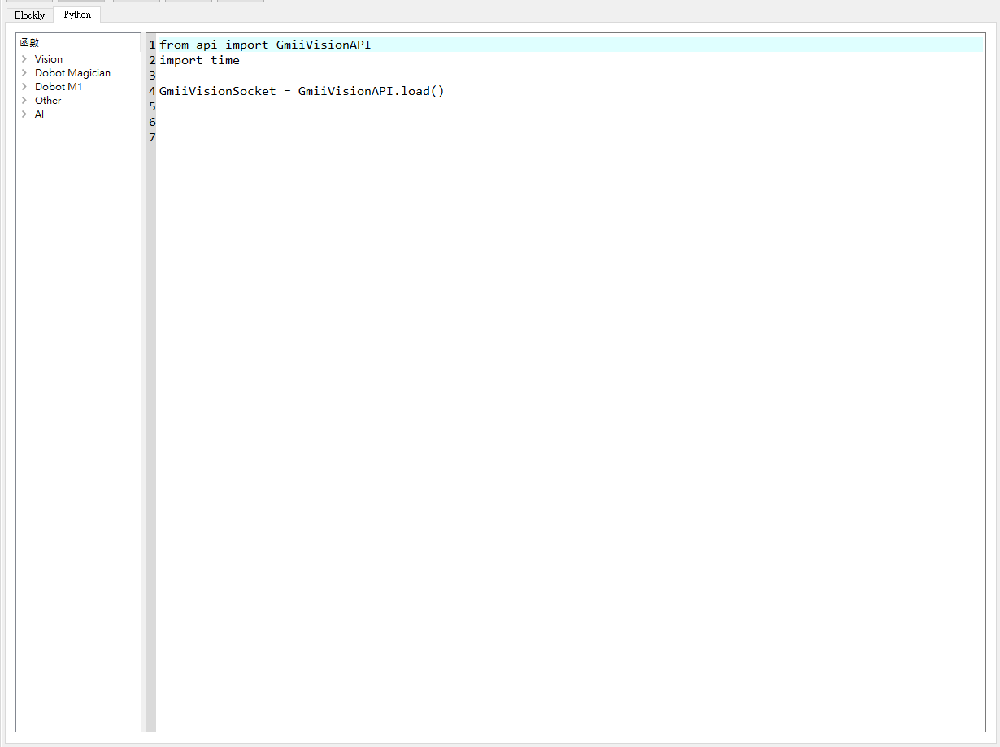
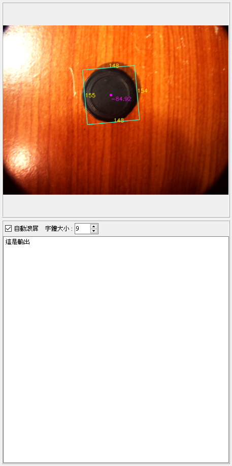

# 任務



使用者可以在任務中編寫自己的程序，我們提供圖形化程式語言Blockly以及Python讓使用者自行選擇想要的方式。若有更改Blockly，則會自動轉譯並更新Python的內容。

## 功能



- 執行、停止：任務執行控制
- 儲存、開啟：任務檔案管理
- 清除：清空任務

## Blockly



左邊目錄提供基本方塊以及視覺和其他設備的方塊。

## Python



左邊目錄提供視覺和其他設備的API。

## 輸出



- 視覺輸出：上方區域為視覺輸出，在任務中使用目標檢測或是分類會在這個區域顯示出影像。
- 文字輸出：在任務中可以輸出文字內容，Blockly使用文字分類裡面的列印方塊，Python使用```print()```API。