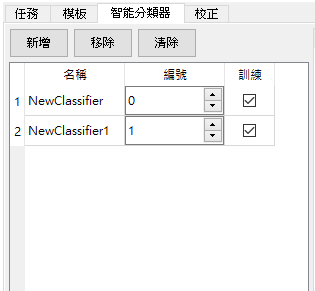
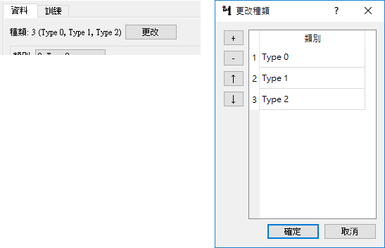
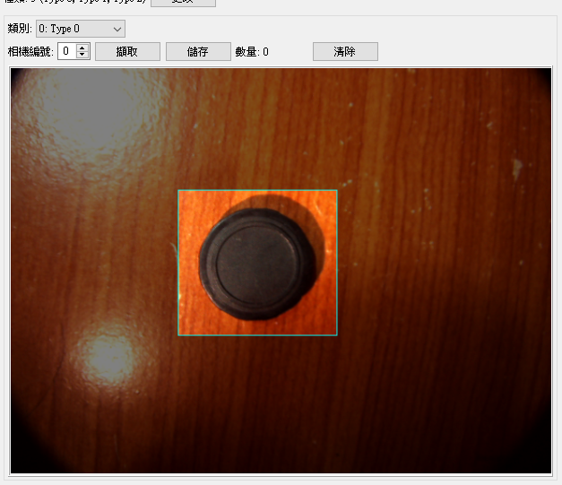
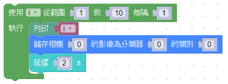
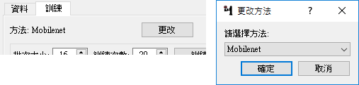
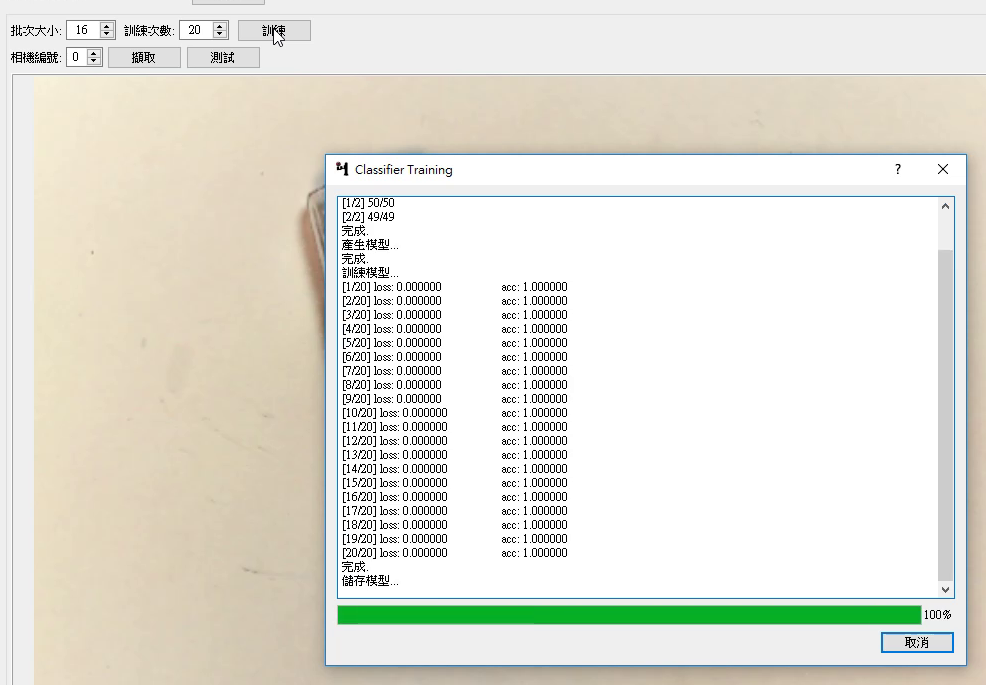
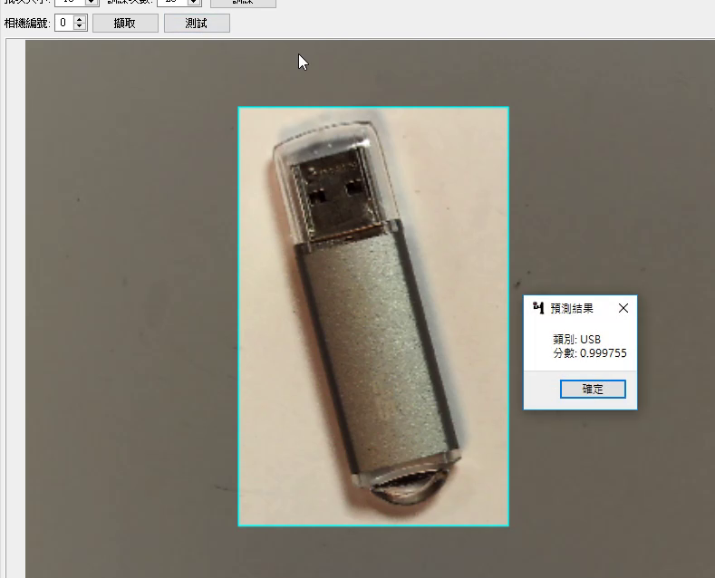

# 智能分類器

智能分類器透過機器學習的方式訓練並分類影像。

## 管理

- 新增、移除、清除所有
- 重新命名：點兩下名稱可以重新命名。
- 更改編號：在任務中可以使用指定編號的智能分類器分類目標。
- 設定細節：點選名稱設定智能分類器的細節。

註：訓練欄位表示這個智能分類器是否已經訓練完成。



## 資料集製作

### 設定種類

點選種類旁邊的更改按鈕開啟跟改種類的視窗。視窗中有新增、刪除和上下移的功能，點選名稱兩下可以重新命名種類名稱。



### 擷取影像

先在類別選單中選擇要設定資料集的類別，選擇相機並擷取其影像，可以直接儲存影像，或是在影像中圈選範圍再儲存。



### 在任務中製作資料集

因為使用智能分類去需要大量的資料，我們建議在任務中製作資料集，藉由API可以將相機影像儲存至指定智能分類器的類別中，也可以儲存目標檢測的結果。

#### Blockly



#### Python

```
from api import GmiiVisionAPI
import time

GmiiVisionSocket = GmiiVisionAPI.load()


i = None


for i in range(1, 11):
  print(i)
  GmiiVisionAPI.ClassifierSave(GmiiVisionSocket, 0, 0, 0) # 相機編號, 分類器編號, 類別
  time.sleep(2)
```

## 訓練

### 選擇方法

目前智能分類器提供之方法有：

1. Mobilenet



### 開始訓練

1. 設定批次大小與訓練次數
    - 批次大小：每一次訓練的資料數量
    - 訓練次數：全部資料集訓練次數
1. 開始訓練



### 測試

訓練分頁下方可以擷取指定編號相機的影像，可以直接測試影像或是在影像上測試訓練好的智能分類器。

