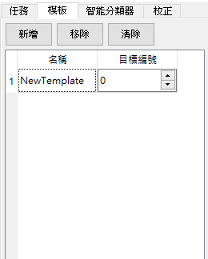
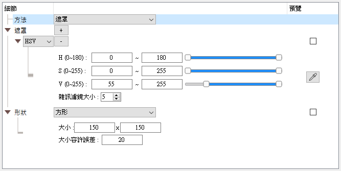
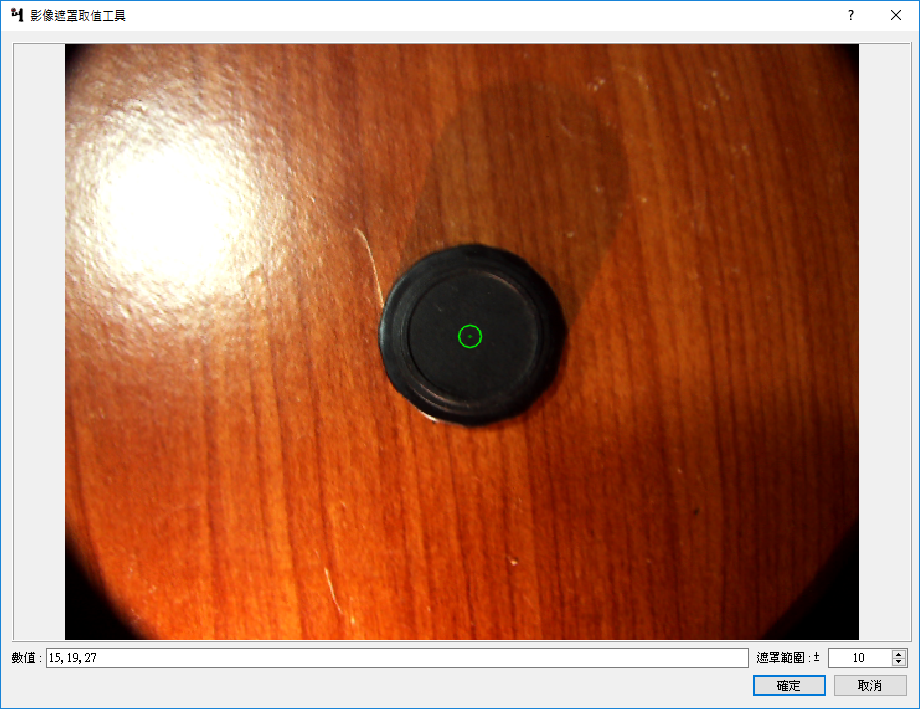
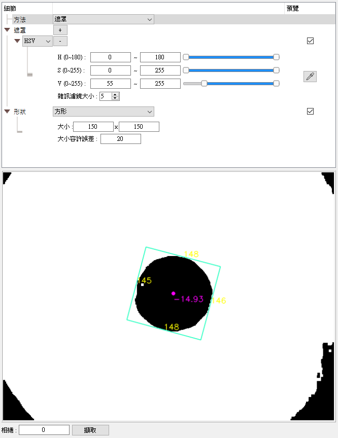

# 模板

模板使用於檢測相機影像中是否有指定的的目標，可以得到目標的數量、位置與旋轉角度等資訊。

## 管理

- 新增、移除、清除所有
- 重新命名：點兩下名稱可以重新命名。
- 更改編號：在任務中可以指定目標編號，系統會使用與指定目標編號相同的模板檢測目標。
- 設定細節：點選名稱設定模板的細節。

## 細節

目前目標檢測提供之方法有：
1. 遮罩

### 遮罩

遮罩提供HSV與灰階的方式檢測目標，可以設定上下限（HSV的H值為角度值，上下限可以相反，例如想要取出紅色，H值設置為170~10，遮罩的H值將會是0~10和170~180的聯集），遮罩的數量不限制。

#### 遮罩取值工具

位於欲設定的遮罩右方預覽欄位按鈕，可以從擷取的相機影像中取得像素值，再調整範圍取得相近的顏色。

注意：要使用這個工具需先開啟相機並在下方預覽區域擷取相機影像。

## 預覽

模板分頁右下方可以擷取指定編號相機的影像，在細節中的預覽欄位勾選欲預覽的項目，可以在擷取的相機影像上看到結果。

